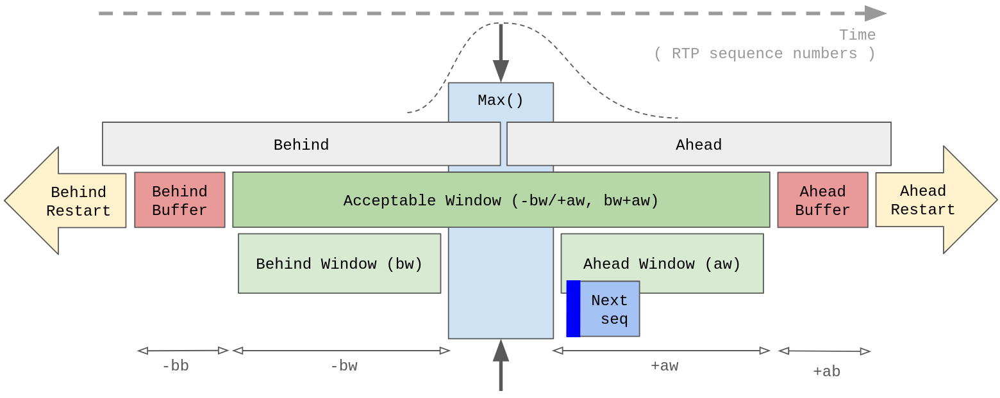

# goTrackingRing

This repo contains a library of code to monitor [RTC 3550 Real Time Protocoo (RTP)](https://www.rfc-editor.org/rfc/rfc3550) sequence numbers.

## RTP Sequence Reporting

It provides the ability to report on:

- RTP sequence loss over time
  - Specifically, it monitors loss within a particular "acceptable window" of packets. e.g. How many packets were lost out of the last 100?
- How many packets were out of order?
- How many packets were late?
- How many jumps ( continuous gaps ) in sequence numbers were there?
- How many duplicate packets were received?

This library is intended to used in conjunction with other code that handles packets and decodes the RTP header. Essentially, this library only concerns itself with tracking uint16 sequence numbers. The intended use is to expose Prometheus metrics to allow longer term reporting over time. e.g. Allows a network operator to monitor trends in packet losses.

There is also a very simple example implmentation.

### RTP Sequence numbers

Reminder on RTP sequence numbers:

- RTP sequence numbers are 2^16
- Encoders should be randomly select the starting sequence number on startup
- With no network losses, the RTP sequence numbers should increment by one
- In real networks there are delays, reordering, which this code aims to track and report upon

This library aims to be efficent from a CPU and memory perspective, and so uses a [B-tree](https://en.wikipedia.org/wiki/B-tree) structure.

## Overview

The solution essentially tracks RTP sequence numbers and then categorizes an arriving packet into various categories.

This diagram provides an overview of the categories defined.



### Definitions

| Definition        | Variable | Description                                                                                                                                                |
| ----------------- | -------- | ---------------------------------------------------------------------------------------------------------------------------------------------------------- |
| Max()             | Max()    | Highest RTP sequence and current reference point. Future packets are all relative to this packet                                                           |
| Ahead             |          | Packet with a higher sequnce number than >Max()                                                                                                            |
| Behind            |          | Packet with a lower sequnce number than <Max()                                                                                                             |
| Acceptable Window | <aw,>bw  | Packets with sequence number in this range are accaptable, which is to total length bw+aw                                                                  |
| Ahead Window      | aw       | Sequence number is within +aw packets of <Max()                                                                                                            |
| Behind Window     | bw       | Sequence number is within -bw packets of >Max()                                                                                                            |
| Safety Buffers    |          | To avoid erronously jumping to a new tracking window, "safety" buffers behind/ahead allow the operator to make sure tracker doesn't reinitilize the window |
| Ahead Buffer      | ab       | Ahead buffer is a logical gap, where if a packet arrives within this range the existing Max() and acceptable window will NOT be regenerated                |
| Behind Buffer     | bb       | Behind buffer is a logical gap, where if a packet arrives within this range the existing Max() and acceptable window will NOT be regenerated               |
| Restart           |          | If the sequence number jumps ahead/behind by a large amount then the encoder has restarted, so the acceptable window needs to be reinitilized              |
| Behind Restart    | >ab      | Sequence number arriving in this range reinitilizes the window                                                                                             |
| Ahead Restart     | <bb      | Sequence number arriving in this range reinitilizes the window                                                                                             |
| Sequence Roll     |          | For now, 2^16 sequence roll will be treated like a restart                                                                                                 |

### Positions

| Position | Description                              |
| -------- | ---------------------------------------- |
| Unknown  |                                          |
| Ahead    | Within the acceptable                    |
| Behind   | Within the safety buffer, and so ignored |

### Categories

| Category | Description                                                                     |
| -------- | ------------------------------------------------------------------------------- |
| Unknown  |                                                                                 |
| Window   | Within the acceptable                                                           |
| Buffer   | Within the safety buffer, and so ignored                                        |
| Reset    | Outside the acceptable window and buffer, causing reinitilization of the window |

### SubCategories

| SubCategory   | Description                                                              |
| ------------- | ------------------------------------------------------------------------ |
| None          | No additional sub catagorization                                         |
| Next Sequence | Next sequence is the packet that will ideally arrive next and is Max()+1 |
| Duplicate     | Duplicate packets are also identified                                    |

> **Please note:**
>
> All the windows and buffers are defined in terms of _packets_ NOT _time_

## Roughly how this code works

### Items in the "acceptable window" are added to the B-tree

Items are added using [.ReplaceOrInsert()](https://pkg.go.dev/github.com/google/btree#BTreeG.ReplaceOrInsert).

For the happy path, this is the next sequence number, and so .Max() advances by one, so the B-tree will become slightly longer to the left.

If the packet is not in sequence, it will also be added to the tree, and may adjust the .Max() forward.

Typically, we expect either complete packet loss, or slight delays in packets, so the expectation is there are gaps in the sequence numbers, or "behind" packets, neither of which will advance the .Max().

This means the B-tree always holds:

- All the sequence numbers seen within the "acceptable window"
  - Iteration is required to get a list of the missing items, although for small window sizes the iteration is relatively inexpensive, although unless there is a very specific debugging scenario this is probably not required.
- Count of the number of packets in the "acceptable window" ( .Len() ). The number of missing packets is merely the "acceptable window" size, minus the number of packets seen.

### Automatic rebalancing of the B-tree

Overtime, the B-tree will become longer on the left ( more items on the left of the tree ), and so the B-tree will rebalanced via rotation+merging. The rebalance is mostly pointer moves, so it's reasonably efficient.

### Items fall off the back of the "behind window"

Of course, as sequence numbers fall off the back of the "behind window", these items need to be removed. This is done by a simple [.Delete()](https://pkg.go.dev/github.com/google/btree#BTreeG.Delete) of a single item, which is just finding the minimum item, so it's efficent.

### Batch deletes ( jump ahead )

If a new item jumps forward the current position of .Max() by more than +1, then essentially multiple items need to be deleted. To make this operation more efficient the [.DescendLessOrEqual()](https://pkg.go.dev/github.com/google/btree#BTreeG.DescendLessOrEqual) iterator is used, deleting as it visits the node. B-trees are efficent at finding the next lower/higher, so this iteration is reasonably efficent.

( An alternative implmentation would be to repeatedly call [.DeleteMin()](https://pkg.go.dev/github.com/google/btree#BTreeG.DeleteMin) until the tail of the "behind window" is reached ( .Max() - bw ), but each delete would traverse the full tree and would not be as efficient as the .DescendLess. )

### Restart of window ( large jump behind/ahead )

If items arrive that are beyond the behind or ahead buffer ( wihtin the "Restart" zones in the diagram ), then these are deemed to be a restart of the RTP encoder. The existing tree is cleared via [.Clear()](https://pkg.go.dev/github.com/google/btree#BTreeG.Clear), and items are put back on the Freelist.

( Honestly, I haven't looked to closely at how the library manages the memory or garbage collection tuning, but hopefully this library is being used with relatively small windows like <=100, so this should be a pretty small memory footprint. I assume from reading words like "freelist" in the documnetation that the library is holding on to memory, which should keep the garbage collection low. I should probably do some profiling and update the finds here.)

### Safety buffers ( large jump behind/ahead )

Given that restarting the window/B-tree will wipe all the packet sequence history, there is a risk that if the window configuration is smaller than packets that may actually arrive, the window will be wiped.

e.g. You could imagine that occationally a packet gets delayed more than expected ( for some unknown reason ), and even if your audio/video decoder may ignore this late packet, the RTP sequence tracker may restart the window and wipe all your useful RTP sequence data.

You probably don't want this, so to protect against this, the "behind and ahead buffers" exist. Essentially, this allows you to configure a bit more space, most importantly the "behind buffer", so reduce this risk.

Of course, the downside of this approach is that there is a small risk the RTP encoder could legitimately restart and start with a new random sequence number that's within acceptable window + buffer range (bb+bw+aw+ab), but with 2^16 the chances are pretty slim, assuming you keep pretty small windows+buffers.

### Configuration comments

The intention is to allow an network operator to tune the monitoring windows to suit the particular network and reporting requirements.

When configuring the various window and buffer seetings, implementors should consider:

- Objectives of the monitoring,
- RTP packet rates,
- Network design in terms of redundant paths, and particularly how the network topology may change impacting end to end latency, particularly during re-convergence

Please keep in mind that the entire "acceptable window" worth of packet sequence numbers is held within the B-tree.

Please refer to this sheet for some simple Mb/s and packet rate calculations
https://docs.google.com/spreadsheets/d/16Wcjm8JVv4121QuZAHokMtMJ6n_b4_QZN73iNydAT5w/edit?usp=sharing

### Example configuration

#### Network with modest variations

For the following environment:

- Video rate of ~10 Mb/s ( estimated packet size of 1380 bytes is ~725 packets per second )
- Maximum network delay of up to 100 milliseconds ( ~725 packets )
- Maximum network path length change of 100 milliseconds ( ~725 packets )

The following configuration might be a good place to start:

| Variable | Packets | Comment        |
| -------- | ------- | -------------- |
| aw       | 725     | ~100 ms ahead  |
| bw       | 725     | ~100 ms behind |
| ab       | 3600    | ~500 ms        |
| bb       | 3600    | ~500 ms        |

This would allow for ~0.2 seconds ( 200 ms ) or ~1449 packets of "acceptable window".

#### Crazy network with pretty large variations

For the following environment:

- Video rate of ~1 Mb/s ( estimated packet size of 1380 bytes is ~725 packets per second )
- Maximum network delay of up to 1 second ( 1000 ms is ~725 packets )
- Maximum network path length change of 0.5 seconds ( 500 ms is ~362 packets )

The following configuration might be a good place to start:

| Variable | Packets | Comment         |
| -------- | ------- | --------------- |
| aw       | 362     | ~500 ms ahead   |
| bw       | 725     | ~1000 ms behind |
| ab       | 500     | ~690 ms         |
| bb       | 500     | ~690 ms         |

This would allow for ~1.5 seconds ( ~1500 ms ) or ~1087 packets of "acceptable window".

Diagram Google Slides link: https://docs.google.com/presentation/d/1gkgs0uZ6YDqRBUeYwPjZWI2JgWBN_54CXdNvueBpjXc/edit?usp=sharing

## Performance considerations

This library was originally designed to monitor RTP video at rates <20 Mb/s, and has not been tested for video rates higher than this. e.g. Not tested with SMPTE-2110 video transport. The b-tree operation times should mostly be <200 ns, so there's a chance it will work ok, but it would need to be carefully tested and potentially some tuning could be done.

Please also note that B-Tree "degree" is currently hard coded to three (3). Tuning this is likely to be required for higher packet rates.

## RTP Header

https://www.rfc-editor.org/rfc/rfc3550#section-5.1

```bash
5.1 RTP Fixed Header Fields

   The RTP header has the following format:

    0                   1                   2                   3
    0 1 2 3 4 5 6 7 8 9 0 1 2 3 4 5 6 7 8 9 0 1 2 3 4 5 6 7 8 9 0 1
   +-+-+-+-+-+-+-+-+-+-+-+-+-+-+-+-+-+-+-+-+-+-+-+-+-+-+-+-+-+-+-+-+
   |V=2|P|X|  CC   |M|     PT      |       sequence number         |
   +-+-+-+-+-+-+-+-+-+-+-+-+-+-+-+-+-+-+-+-+-+-+-+-+-+-+-+-+-+-+-+-+
   |                           timestamp                           |
   +-+-+-+-+-+-+-+-+-+-+-+-+-+-+-+-+-+-+-+-+-+-+-+-+-+-+-+-+-+-+-+-+
   |           synchronization source (SSRC) identifier            |
   +=+=+=+=+=+=+=+=+=+=+=+=+=+=+=+=+=+=+=+=+=+=+=+=+=+=+=+=+=+=+=+=+
   |            contributing source (CSRC) identifiers             |
   |                             ....                              |
   +-+-+-+-+-+-+-+-+-+-+-+-+-+-+-+-+-+-+-+-+-+-+-+-+-+-+-+-+-+-+-+-+
```

## Btree libraries for golang

This is a list of some golang btree implmentations.

For now, I've decided to use [Google's golang btree](https://pkg.go.dev/github.com/google/btree) implmentation, until I know a reason not too.

Functions: https://pkg.go.dev/github.com/google/btree#pkg-functions

The scylladb writeup make it look like a reasonable library:

https://www.scylladb.com/2022/04/27/shaving-40-off-googles-b-tree-implementation-with-go-generics/

We are using the "generic" implemention: https://github.com/google/btree/issues/41

Other AVL tree implementations

https://github.com/VictorLowther/btree

https://github.com/tsuzu/go-avl/blob/master/avl_test.go

https://github.com/ross-oreto/go-tree

### Note for myself

Markdown syntax link: https://www.markdownguide.org/basic-syntax/
